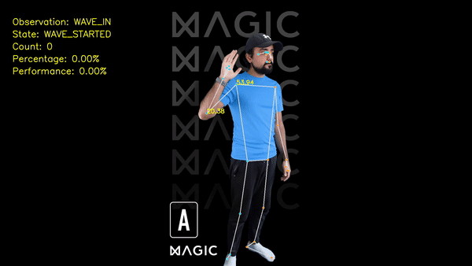

# Magic Fit Wave Analysis Task

This repository contains the code to solve a simple exercise involving the analysis of a person waving a number of times. The aim is to produce a function that given the pose data extracted by the MediaPipe Pose library will return:

1. The percentage completion of the current 'wave' action
2. The number of times a 'wave' has been completed

## Instructions

1. Setup a virtual environment:

```
python3 -m venv mp_env 
```

```
source mp_env/bin/activate
```

1. Install dependencies:

```
pip install -r requirements.txt
```

2. Run solution

```
python3 wave_task.py
```

## Solution Summary

To solve this problem I calculated the elbow and shoulder joint angles from the MediaPipe Pose landmarks. I then classify a 'wave' as an action where the elbow joint moves past a threshold of 45 degrees and then returns again. I classify a wave as **WAVE_IN** if it's less than 45 degrees and **WAVE_OUT** if it's greater than 45. Then, using some simple state logic I'm able to count the number of times a person goes through the sequence **WAVE_IN -> WAVE_OUT -> WAVE_IN** to produce my wave count.

To calculate the wave percentage I decided to define what an ideal wave would be. I define this as one which starts close to **15** degrees and gets to **65** degrees. This allowed me to calculate a percentage based on how far a wave had progressed within this range. It also provides an additional opportunity to score the **'form'** of a wave by how close a user got to the maximum target angle. In a similar way to how someone may be assessed when exercising. An example of the visualised output is shown below:

**Note** I didn't use the performance assessment to count reps as Magic Fit does in your example as it wasn't explicity mentioned in the task description but this would be an easy modification.



I chose this simple calculation method as all the necessary calculations are extremely fast and have minimal dependencies. I think the joint angle features approach works well for this and many other exercises, I'd only add some additional features such as relative distances between joints where those are relevant for particular exercises.

Screen recodings of the output can be found here:

1. [magicfit_console_recording.mp4](magicfit_console_recording.mp4)
2. [magicfit_full_recording.mp4](magicfit_full_recording.mp4)

## Solution Detailed Description

The MediaPipe Pose algorithm extracts 33 pose landmarks, from these landmarks we need to determine what constitutes a wave action.


The first thing I concluded here was to look at what joints of the arm are involved in the action and which were the relevant properties. I concluded that the **shoulder**, **elbow** and **hand** were clearly key landmarks. Additionally key attributes worth exploring were:

1. Relative distances between joints
2. Joint angles

While both properties would be useful in classifying a **wave action** I chose to move forward with the joint angles as I felt this would provide a more generalisable solution that wouldn't depend on the lengths of different people's limbs.

The next step was to define what constitutes a wave in terms of **joint angle** properties of the relevant joints (shoulder and elbow). In the context of exercise I thought defining a wave in terms of some key properties as if it were an exercise would be useful, with that in mind I defined a wave as:

1. A movement of the elbow that starts with the wrist close to the shoulder.
2. The shoulder remains at a fixed angle while only the elbow moves.
3. The wrist moves away from the shoulder and the elbow angle must cross at least 45 degrees to be considered a full wave.
4. Ideally the start and end point of the wave would be ~15 and ~65 degrees respectively.

## Implementation

I've created three files for my solution:

1. [wave_task.py](wave_task.py)
2. [landmark_analyser.py](landmark_analyser.py)
3. [utils.py](utils.py)

The [wave_task.py](wave_task.py) file is the main script which loads the video file, extracts the pose landmarks, runs the analysis and outputs the results. The most interesting files are [utils.py](utils.py) and  [landmark_analyser.py](landmark_analyser.py) in which the bulk of the interesting analysis is done.

#### Angle Calculation & Classification

The angle calculation function ([utils.py](utils.py)) uses some basic trigonometry (atan2 function) to calculate the in-plane joint angles from pose landmarks. For example, from the (x, y) coordinates from the shoulder -> elbow -> wrist we can compute the joint angle of the elbow.

```python
def calc_angle(j1: List, j2: List, j3: List):
   # convert to numpy arrays
   j1 = np.array(j1)
   j2 = np.array(j2)
   j3 = np.array(j3)
 
   # compute angle from joint coordinates
   angle_rads = np.arctan2(j3[1] - j2[1], j3[0] - j2[0]) - np.arctan2(
       j1[1] - j2[1], j1[0] - j2[0]
   )
 
   # convert to degrees
   angle_deg = np.degrees(angle_rads)
 
   # wrap angle to between 0 and 180
   if angle_deg > 180.0:
       angle_deg -= 360.0
 
   return angle_deg
```

Now in [landmark_analyser.py](landmark_analyser.py) we have a function which uses the calculated elbow angle to classify whether the user is in the WAVE_IN and WAVE_OUT position using the threshold of 45 degrees (self.wave_angle_thresh). Technically I should also add a threshold for the shoulder angle to make sure it's in the correct position but I omitted that to keep things simple. This function returns a WaveObservation which is just an enum that can be either WAVE_IN or WAVE_OUT.

```python
def _classify_wave_angle(self, elbow_angle):
   wave_observation = None
   if elbow_angle < self.wave_angle_thresh:
       wave_observation = WaveObservation.WAVE_IN
   else:
       wave_observation = WaveObservation.WAVE_OUT
 
   return wave_observation
```

#### State Logic & Rep Counting

The function demonstrates the state logic and rep counting functionality the state path of a complete wave should be:

```
WAVE_INIT -> WAVE_STARTED -> WAVE_OUTWARD -> WAVE_INWARDS -> WAVE_COMPLETE
```

I make use of the WaveObservation and another feature is the wave_direction which I just compute by subtracting the previous observed elbow_angle from the current one. (See [landmark_analyser.py](landmark_analyser.py))

```python
def _handle_wave_logic(
   self, wave_observation: WaveObservation, wave_direction: int):
  
   if self.wave_state == WaveState.WAVE_INIT:
       if wave_observation == WaveObservation.WAVE_IN:
           self.wave_state = WaveState.WAVE_STARTED
   elif self.wave_state == WaveState.WAVE_STARTED:
       if wave_direction > 0:
           self.wave_state = WaveState.WAVE_OUTWARD
   elif self.wave_state == WaveState.WAVE_OUTWARD:
       if wave_direction < 0:
           self.wave_state = WaveState.WAVE_INWARDS
   elif self.wave_state == WaveState.WAVE_INWARDS:
       if wave_observation == WaveObservation.WAVE_IN and wave_direction == 0:
           self.wave_state = WaveState.WAVE_COMPLETE
   elif self.wave_state == WaveState.WAVE_COMPLETE:
       self.wave_count += 1
       self.max_performance = 0
       self.wave_state = WaveState.WAVE_INIT
```

This state logic is perhaps more granular than it needs to be to achieve the task but I think it provides a useful opportunity to track the performance of the user. It's quite trivial to track the time in each state so we can calculate how long the OUTWARD and INWARD swings are, or how long the use pauses between waves. These could all be used to provide helpful feedback to the end user.

#### Percentage Calculation

The percentage calculation was slightly tricky, on the OUTWARD pass I calculated the percentage based on the current elbow angle divided by the max_angle of the ideal wave (65) minus the min angle of the ideal wave (15). This is multiplied by 50 instead of 100 as the OUTWARD swing only represents 50% of the wave action.

On the INWARD pass the percentage is calculated by subtracting the current elbow angle from the max_angle of the ideal wave. This gives us an increasing percentage even though the elbow angle is getting smaller. Finally this percentage is bumped by 50% as I assume the user has completed the OUTWARD pass. This may not necessarily be true and this can be corrected by storing the calculation from the forward pass and adding this instead but I chose to keep things simple for this task. (See [landmark_analyser.py](landmark_analyser.py))

```python
def _calc_wave_percentage(self, wave_angle: float, move_direction: float) -> float:
   perc = 0
   if move_direction > 0:
       perc = (
           (wave_angle - self.min_angle) / (self.max_angle - self.min_angle) * 50.0
       )
   elif move_direction <= 0:
       perc = (
           (self.max_angle - wave_angle) / (self.max_angle - self.min_angle) * 50.0
       )
       perc += 50.0
   return perc
```
